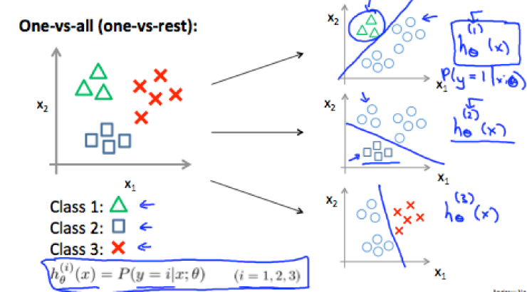
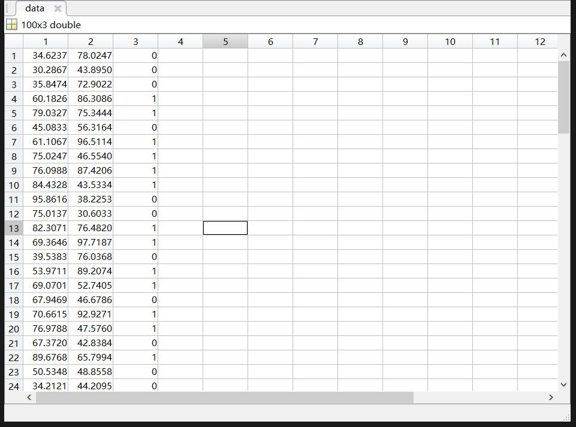
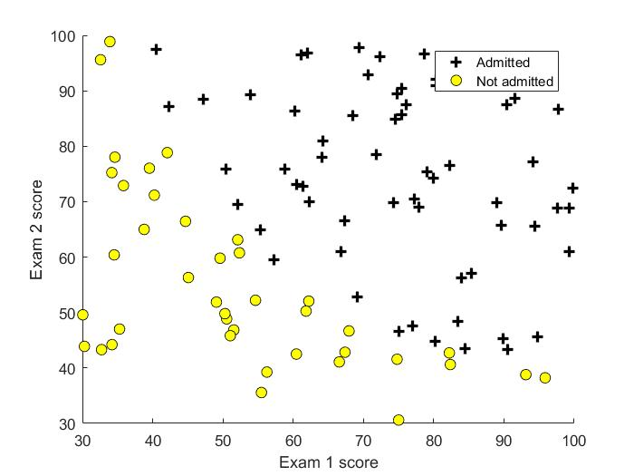
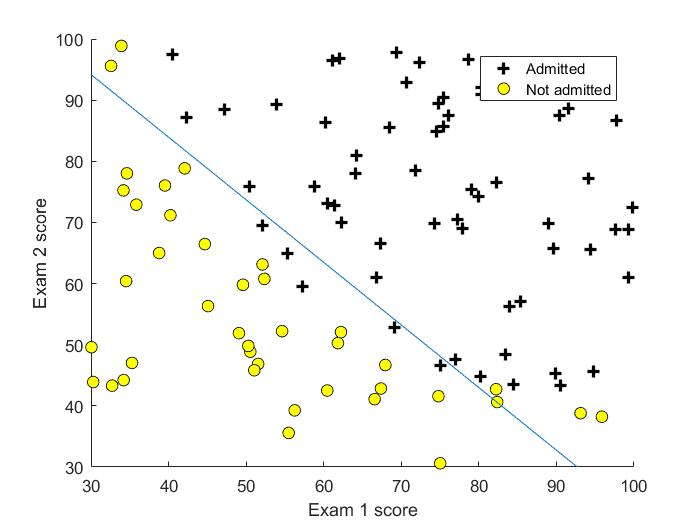

# Logistic 回归

​	为了实现分类算法，一种方法是应用线性回归，并且将所有预测结果映射到 [0,0.5] 和 [0.5,1] 两个区间内。然而分类问题可能并非线性方程，此时这种方式可能失效。

​	引用课件中对分类问题的分析：

> ​	The classification problem is just like the regression problem, except that the values we now want to predict take on only a small number of discrete values. For now, we will focus on the binary classification problem in which y can take on only two values, 0 and 1. (Most of what we say here will also generalize to the multiple-class case.) For instance, if we are trying to build a spam classifier for email, then $x^{(i)}$ may be some features of a piece of email, and y may be 1 if it is a piece of spam mail, and 0 otherwise. Hence, y∈{0,1}. 0 is also called the negative class, and 1 the positive class, and they are sometimes also denoted by the symbols “-” and “+.” Given  $x^{(i)}$ , the corresponding  $y^{(i)}$ is also called the label for the training example.


* ## 假设模型（Hypothesis Representation）

​	以二分类问题为例，我们能够明确全部的分类结果只包括0，1。如果直接应用此前的线性回归的方法，当预测值大于0.5时即分类为1，小于0.5时分类为0，但如果预测结果超过了[0,1]区间，显然是无法解释的。因此，我们改变原有的假设模型，使其最终的值域落在[0,1]之间。一种方法是使用 sigmoid 函数，也叫做"Logistic Function"
$$
h_\theta(x)=g(\theta^Tx)\\
z=\theta^Tx\\
g(z)=\frac{1}{1+e^{-z}}
$$
sigmoid函数图像


​	$h_\theta(x)$ 将给出一个对输入值是1的预测概率，例如，当 $h_\theta(x)=0.7$ 时意味着对输入样本分类是1的概率为0.7 


* ## 决策边界

​	为了能够获得离散的分类值 0 或者 1 ，我们可以将输出值做如下转换：
$$
h_\theta\ge0.5\rightarrow y=1\\
h_\theta\lt0.5\rightarrow y=1\\
$$
​	参照（1），可以看出：
$$
g(z)\ge0.5\quad when \ z\ge0\\
z=0,\ e^{0}\rightarrow 1 \Rightarrow g(z)=1/2\\
z\rightarrow\infty,\ e^{-\infty}\rightarrow 0 \Rightarrow g(z)=1\\
z\rightarrow-\infty,\ e^{\infty}\rightarrow \infty \Rightarrow g(z)=0
$$
​	对于函数 $g(z)$ 的输入 $\theta^Tx$ ：
$$
h_\theta(x)=g(\theta^Tx)\ge0.5\quad when \quad \theta^Tx\ge0
$$
​	**决策边界**就是划分预测值 $y=1$ 和 $y=0$ 的边界值，这是由假设函数所决定的。


* ## 代价函数（cost function）

​	Logistic 回归的代价函数不能再采用线性回归的方式，因为 Logistic 回归函数的图像是分段的并不平滑，这将会产生局部最优区域，使用梯度下降 cost function 将不能顺利到达全局最优点。换句话说，这种情况下的代价函数不是凸函数。因此，我们使用以下形式的代价函数：
$$
J(\theta)=\frac{1}{m}\sum_{i=1}^mCost(h_\theta(x^{(i)}),y^{(i)})\\
Cost(h_\theta(x^{(i)}),y^{(i)})=-\log(h_\theta(x))\quad\quad\ \ \  if\quad y=1\\
Cost(h_\theta(x^{(i)}),y^{(i)})=-\log(1-h_\theta(x))\quad if\quad y=0
$$
​	当样本**真实值** $y=1$ 时，$J(\theta) - h_\theta(x)$  的图像如下所示


 

​	样本**真实值** $y=0$ 时，$J(\theta) - h_\theta(x)$  的图像如下所示


$$
Cost(h_\theta(x),y)=0\quad \ \ \ if\ h_\theta(x)=y\\
Cost(h_\theta(x),y)\rightarrow\infty\quad if\ y=0\  and\  h_\theta(x)\rightarrow1\\
Cost(h_\theta(x),y)\rightarrow\infty\quad if\ y=1\  and\  h_\theta(x)\rightarrow0\\
$$

>If our correct answer 'y' is 0, then the cost function will be 0 if our hypothesis function also outputs 0. If our hypothesis approaches 1, then the cost function will approach infinity.
>If our correct answer 'y' is 1, then the cost function will be 0 if our hypothesis function outputs 1. If our hypothesis approaches 0, then the cost function will approach infinity.
>Note that writing the cost function in this way guarantees that J(θ) is convex for logistic regression.


* ## 简化形式的代价函数和梯度下降法

  简化形式的 cost function 有着和上一小节一样的性质，但不再是分段函数，而有着更简洁形式：

$$
Cost(h_\theta(x),y)=-ylog(h_\theta(x))-(1-y)log(1-h_\theta(x))
$$

​	不难看出，当 y=1 或者 y=0 时，（7）都变为上一小节的对应形式（5）。此时，写出完整的 cost function：
$$
J(\theta)=-\frac{1}{m}\sum_{i=1}^m[y^{(i)}\log(h_\theta(x))+(1-y^{(i)})\log(1-h_\theta(x^{(i)}))]
$$
​	梯度下降法的通常形式：
$$
repeat\{\\
\theta_j:=\theta_j-\alpha\frac{\partial}{\partial\theta_j}J(\theta)\\    
\}\quad\quad\quad\quad\quad\quad\quad\quad\quad\quad\quad\quad\quad\quad\quad\quad\quad\quad\quad\quad\quad\quad\quad\quad\quad\quad\quad\quad\quad\quad\quad\quad
$$

​	下面是导数项的求导过程：

化简 $J(\theta)$ ：
$$
h_\theta(x) = \frac{1}{1+e^{-(\theta_0+\theta_1x1+\dots+\theta_nx_n)}}\\
J(\theta )=-\frac{1}{m}\sum_{i=1}^m[y^{(i)}\log(h_\theta(x^{(i)}))+(1-y^{(i)})\log(1-h_\theta(x^{(i)}))]\\
J(\theta)=-\frac{1}{m}\sum_{i=1}^m[y^{(i)}\log(\frac{1}{1+e^{-(\theta_0+\theta_1x1+\dots+\theta_nx_n)}})+(1-y^{(i)})\log(1-\frac{1}{1+e^{-(\theta_0+\theta_1x1+\dots+\theta_nx_n)}})]\\
\quad\quad=-\frac{1}{m}\sum_{i=1}^m[y^{(i)}[-\log(1+e^{-(\theta_0+\theta_1x1+\dots+\theta_nx_n)})]+(1-y^{(i)})[\log(e^{-(\theta_0+\theta_1x1+\dots+\theta_nx_n)})-\log(1+e^{-(\theta_0+\theta_1x1+\dots+\theta_nx_n)})]]\\
\quad\quad=-\frac{1}{m}\sum_{i=1}^m[\log(e^{-(\theta_0+\theta_1x1+\dots+\theta_nx_n)})-\log(1+e^{-(\theta_0+\theta_1x1+\dots+\theta_nx_n)})-y^{(i)}\log(e^{-(\theta_0+\theta_1x1+\dots+\theta_nx_n)})]\quad\quad\quad\quad\quad\quad\quad\quad\quad\quad\\
=-\frac{1}{m}\sum_{i=1}^m[\log(e^{-(\theta_0+\theta_1x1+\dots+\theta_nx_n)})(1-y^{(i)})-\log(1+e^{-(\theta_0+\theta_1x1+\dots+\theta_nx_n)})]\quad\quad\quad\quad\quad\quad\quad\quad\quad\quad\quad\quad\quad\quad\quad\quad\quad\\
=-\frac{1}{m}\sum_{i=1}^m[-(\theta_0+\theta_1x1+\dots+\theta_nx_n)(1-y^{(i)})-\log(1+e^{-(\theta_0+\theta_1x1+\dots+\theta_nx_n)})]\quad\quad\quad\quad\quad\quad\quad\quad\quad\quad\quad\quad\quad\quad\quad\\\
=\frac{1}{m}\sum_{i=1}^m[(\theta_0+\theta_1x1+\dots+\theta_nx_n)(1-y^{(i)})+\log(1+e^{-(\theta_0+\theta_1x1+\dots+\theta_nx_n)})]\quad\quad\quad\quad\quad\quad\quad\quad\quad\quad\quad\quad\quad\quad\quad\
$$

对 $\theta_j$ 求导：
$$
\frac{\partial}{\partial\theta_j}J(\theta)=\frac{1}{m}\sum_{i=1}^m[x_j(1-y^{(i)})+\frac{1}{1+e^{-(\theta_0+\theta_1x1+\dots+\theta_nx_n)}}e^{-(\theta_0+\theta_1x1+\dots+\theta_nx_n)}(-1)x_j]\\
=\frac{1}{m}\sum_{i=1}^m[1-y^{(i)}-\frac{1}{1+e^{-(\theta_0+\theta_1x1+\dots+\theta_nx_n)}}e^{-(\theta_0+\theta_1x1+\dots+\theta_nx_n)}]x_j\\
=\frac{1}{m}\sum_{i=1}^m[\frac{1}{1+e^{-(\theta_0+\theta_1x1+\dots+\theta_nx_n)}}-y^{(i)}]x_j\quad\quad\quad\quad\quad\quad\quad\quad\quad\quad\\
=\frac{1}{m}\sum_{i=1}^m[h_\theta(x^{(i)})-y^{(i)}]x_j\quad\quad\quad\quad\quad\quad\quad\quad\quad\quad\quad\quad\quad\quad\quad\quad
$$

因此，对  $\theta_j$ 的更新公式：
$$
repeat\{\\
\theta_j:=\theta_j-\frac{\alpha}{m}\sum_{i=1}^m[h_\theta(x^{(i)})-y^{(i)}]x_j\\    
\}\quad\quad\quad\quad\quad\quad\quad\quad\quad\quad\quad\quad\quad\quad\quad\quad\quad\quad\quad\quad\quad\quad\quad\quad\quad\quad\quad\quad\quad\quad\quad\quad
$$
不难发现此时的算法似乎和线性回归一样，但是需要注意的是，虽然形式一样但二者的 $h_\theta(x^{(i)})$ 是不一样的。


* ## 在Matlab中使用更加复杂的优化算法

>"Conjugate gradient", "BFGS", and "L-BFGS" are more sophisticated, faster ways to optimize θ that can be used instead of gradient descent. We suggest that you should not write these more sophisticated algorithms yourself (unless you are an expert in numerical computing) but use the libraries instead, as they're already tested and highly optimized. Octave provides them.

事先需要能够计算出 $J(\theta)$ 和 $\frac{\partial}{\partial\theta_j}J(\theta)$ 代码如下：

```matlab
% Initialize fitting parameters
initial_theta = zeros(n + 1, 1);

%  Set options for fminunc
options = optimset('GradObj', 'on', 'MaxIter', 400);

%  Run fminunc to obtain the optimal theta
%  This function will return theta and the cost 
[theta, cost] = ...
	fminunc(@(t)(costFunction(t, X, y)), initial_theta, options);
```


* ## 多分类问题

​	目前的方法已经能够实现二分类问题，$y\in\{0,1\}$ 当问题拓展至多个分类时， $y\in \{0,1,\dots,n\}$ 此时将问题划分为 n+1 个二分类问题，为每一个分类设计一个分类器，如图所示。




* ## Logistic 回归实例

  程序：\machine-learning-ex2\ex2.m

  文档：\machine-learning-ex2\ex2.pdf

  数据样本分布情况：

  

  

  值得一提的是该实例中数据可视化部分的代码：

```matlab
function plotData(X, y)
%PLOTDATA Plots the data points X and y into a new figure 
%   PLOTDATA(x,y) plots the data points with + for the positive examples
%   and o for the negative examples. X is assumed to be a Mx2 matrix.

% Create New Figure
figure; hold on;

% ====================== YOUR CODE HERE ======================
% Instructions: Plot the positive and negative examples on a
%               2D plot, using the option 'k+' for the positive
%               examples and 'ko' for the negative examples.
%
% Find Indices of Positive and Negative Examples
pos = find(y==1); neg = find(y==0);
% Plot Examples
plot(X(pos, 1), X(pos, 2), 'k+','LineWidth', 2, ...
'MarkerSize', 7);
hold on;
plot(X(neg, 1), X(neg, 2), 'ko', 'MarkerFaceColor', 'y', ...
'MarkerSize', 7);
% =========================================================================
hold off;

end
```


cost function:

```matlab
function [J, grad] = costFunction(theta, X, y)
%COSTFUNCTION Compute cost and gradient for logistic regression
%   J = COSTFUNCTION(theta, X, y) computes the cost of using theta as the
%   parameter for logistic regression and the gradient of the cost
%   w.r.t. to the parameters.

% Initialize some useful values
m = length(y); % number of training examples

% You need to return the following variables correctly 
J = 0;
grad = zeros(size(theta));

% ====================== YOUR CODE HERE ======================
% Instructions: Compute the cost of a particular choice of theta.
%               You should set J to the cost.
%               Compute the partial derivatives and set grad to the partial
%               derivatives of the cost w.r.t. each parameter in theta
%
% Note: grad should have the same dimensions as theta
%
h = sigmoid(X*theta);
J = 1/m*(sum(-y.*log(h)-(1-y).*log(1-h)));

for i=1:size(theta,1)
    grad(i) = mean((h-y).*X(:,i));
end

% =============================================================
end

```


使用 GradObj 优化方法：

```matlab
initial_theta = zeros(n + 1, 1);
%  Set options for fminunc
options = optimset('GradObj', 'on', 'MaxIter', 400);

%  Run fminunc to obtain the optimal theta
%  This function will return theta and the cost 
[theta, cost] = ...
	fminunc(@(t)(costFunction(t, X, y)), initial_theta, options);
```


决策边界：（决策边界的绘制也有一定技巧，将在下一节讨论）




