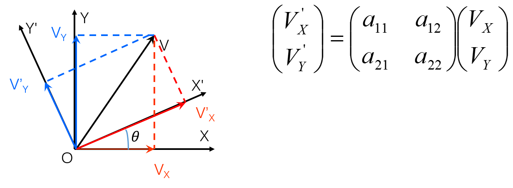
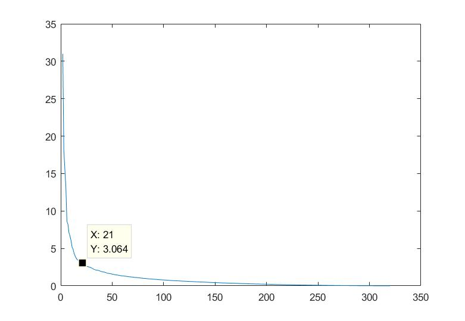
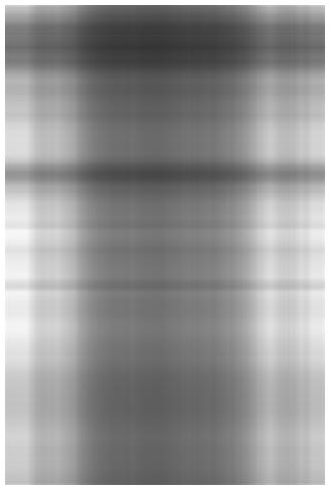
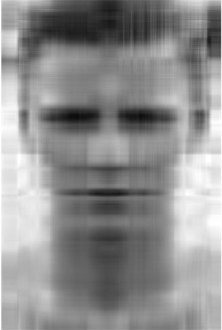

# 奇异值分解（SVD）原理及推导

​		SVD（Singular Value Decomposition）是线性代数中一种重要的矩阵分解，在某些方面与对称矩阵基于特征向量的对角化类似。在数据降维和矩阵压缩存储方面有着重要的应用。

## 正交矩阵

​		首先从正交矩阵的变换入手，考察矩阵乘法的本质，由图中可见对于矩阵的乘法，即可以看做行向量向列向量的内积，也可以看做是对列向量的线性组合。

图1

​		假设 XOY 平面上有向量 $\vec{OV}=(V_x,V_y)^T$ ，现将 XOY 坐标系逆时针旋转 $\theta$ °得到 X'OY' 坐标系，则，在新坐标系下 $\vec{OV}$ 的坐标 $(V'_x,V'_y)^T$ ，可表示为 $(V'_x,V'_y)^T=A(V_x,V_y)^T$，其中 A 如下图所示，是一个单位正交矩阵。

图2

​		从 图2 中可以看出，$(V'_x,V'_y)^T$ 是 $\vec{OV}$  向量在新坐标系的基向量 $\vec{OX'}$ 和 $\vec{OY'}$ 上的投影，但因为这两个基向量都是单位向量，因此任何向量在与其的内积就是该向量在这个方向上的投影值。因此不难从 图1 矩阵乘法的几何意义中发现，实际上 $(a_{11},a_{12})$ 就是 $\vec{OX'}$ 在 XOY 坐标系下的表述， $(a_{21},a_{22})$ 就是 $\vec{OY'}$ 在 XOY 坐标系下的表述。

​		此外，由于 $(V_x,V_y)^T$ 本身又是 $\vec{OV}$ 在原始坐标系 $\vec{OX}$ 和 $\vec{OY}$ 上的投影，把 图2 的变换公式从 图1 中线性组合的角度来看，向量 $(a_{11},a_{21})^T$ 即是 $\vec{OX}$ 在 X‘OY’ 坐标系下的表述， $(a_{12},a_{22})$ 就是 $\vec{OY}$ 在 X'OY' 坐标系下的表述。

​		于是根据旋转角度可以推出 A ：
$$
A=
\left[\begin{matrix}
\cos\theta & sin\theta\\
-\sin\theta & \cos\theta
\end{matrix}\right]
$$

​		注意此时的观察方式是：坐标系按逆时针旋转 $\theta$ ° ，对应的也可以理解为保持坐标系不变，向量 $\vec{OV}$ 顺时针旋转了相同的角度。

​		对于变换矩阵 A 而言，当要以后一种描述时，即：向量 $\vec{OV}$ 顺时针旋转角度 $\theta$  或者 向量 $\vec{OV}$ 逆时针旋转角度 $\theta'=(2\pi-\theta)$ ，因此，当默认是向量旋转，且旋转方向为逆时针时，变换矩阵  $A(\theta)$ 变为 $A(\theta')$ （这是 A 矩阵的另外一种形式）
$$
A=
\left[\begin{matrix}
\cos\theta & -sin\theta\\
\sin\theta & \cos\theta
\end{matrix}\right]
$$

## 特征值分解 EVD

​		在开始讨论 SVD 之前，首先讨论矩阵的特征值分解（EVD），选择对称阵——它总能对角化，并且不同特征值对应的特征向量两两正交。假设存在满秩对称阵 $A_{m\times m}$ ，它有 m 个不同的特征值，$\lambda_i(i=1,2,\dots m)$ ，对应的单位特征向量为 $x_i(i=1,2,\dots m)$ 。则有：
$$
Ax_1=\lambda_1x_1\\
Ax_2=\lambda_2x_2\\
\vdots\\
Ax_m=\lambda_mx_m\\
$$
​		进而可以写成
$$
AU=U\Lambda\\
U=[x_1\ x_2\ \dots\ x_m]\\
\Lambda=\left[\begin{matrix}
\lambda_1 & \dots & 0\\
\vdots & \ddots & \vdots\\
0 & \dots & \lambda_m
\end{matrix}\right]
$$
​		于是可以得到（因为 U 是单位正交阵）
$$
A=U\Lambda U^{-1}=U\Lambda U^T
$$

​		至此，对于矩阵 A 的特征值分解的推导已经结束，下面说明一些分解的意义和由此导出的性质。矩阵 Ａ 分解为对应的三个映射（变换），现在假设有向量 $\vec p$ ，用 A 将其变换到 A 的列空间中：
$$
Ap = U\Lambda U^Tp
$$
​		其中 U、U‘  都是正交矩阵，U 先对 $\vec p$ 进行正交变换，它将 $\vec p$ 用新的坐标系表出，这个坐标系是 A 的所有特征向量构成的坐标系，假设将 $\vec p$ 用 A 的所有特征向量表示为（注意 p 和 $x_i$ 都是向量）：
$$
p = a_1x_1+a_2x_2+\dots+a_mx_m
$$
​		则通过第一个变换就可以把 x 表示为 $[a_1\ a_2\ \dots\ a_m]^T$，注意 $x^T_ix_j=1(i=j)$ 
$$
U\Lambda U^Tx=U\Lambda
\left[\begin{matrix}
x_1^T\\
x_2^T\\
\vdots\\
x_m^T
\end{matrix}\right](a_1x_1+a_2x_2+\dots+a_mx_m)=U\Lambda
\left[\begin{matrix}
a_1\\
a_2\\
\vdots\\
a_m
\end{matrix}\right]
$$
​		紧接着，在新的坐标系下，由中间的对角阵 $\Lambda$ 对新的坐标进行变换，其作用效果就是将向量往各个轴的方向拉伸或者压缩：
$$
U\Lambda
\left[\begin{matrix}
a_1\\
a_2\\
\vdots\\
a_m
\end{matrix}\right]=U
\left[\begin{matrix}
\lambda_1 & \dots & 0\\
\vdots & \ddots & \vdots\\
0 & \dots & \lambda_m
\end{matrix}\right]
\left[\begin{matrix}
a_1\\
a_2\\
\vdots\\
a_m
\end{matrix}\right]= U
\left[\begin{matrix}
\lambda_1 a_1\\
\lambda_2 a_2\\
\vdots\\
\lambda_m a_m
\end{matrix}\right]
$$

​		最后一个变换就是 U 对拉伸或压缩后的变量做变换，由于 U 和 U’ 是互逆矩阵，因此 U 又会将第一次变换的坐标还原，由此可以得出结论：**任意一个对称阵所做的变换仅会对原向量进行拉伸和压缩（U 和 U‘ 相互抵消了），因此，根据对称阵A的特征向量，如果A是2*2的，那么就可以在二维平面中任意一个矩形经过A变换后还是矩形（不改变正交性）。**

  

## 奇异值分解 SVD

​		对于对称阵而言，任意一组正交基经过变换后被映射到了另一组正交基。那么，对于任意的 $m\times n$ 矩阵，能否找到一组正交基使得进过它的变换以后还是正交基？答案是肯定的，这也是 SVD 的核心所在。

​		假设存在矩阵 $A_{m\times n}$ ，现在的目标是：在 n 维空间中找一组正交基，使得经过 A 的变换以后还是正交的。假设已经找到这样一组正交基：
$$
\{v_1,v_2,\dots,v_n\}
$$
​		则 A 矩阵将这组基映射为：
$$
\{Av_1,Av_2,\dots,Av_n\}
$$
​		如果要使它们两两正交，即：
$$
Av_i\sdot Av_j=(Av_i)^TAv_j=v_i^TA^TAv_j=0
$$
​		根据假设，存在：
$$
v_i^Tv_j=v_i\sdot v_j=0
$$
​		**如果，选择正交基 v 为 A’A 的特征向量**，由于 A‘A 是对称阵， v 之间两两正交，那么：
$$
\left.\begin{aligned}
v_i^TA^TAv_j
& =v_i^T\lambda_jv_j\\
& =\lambda_jv_i^Tv_j\\
& =\lambda_jv_i\sdot v_j=0
\end{aligned}\right.
$$
​		这样就找到了正交基映射后还是正交基了，现在，将映射后的正交基单位化：
$$
Av_i\sdot Av_i=v_i^TA^TAv_i=\lambda_iv_i\sdot v_i=\lambda_i\\
|Av_i|^2=\lambda_i\ge0\\
u_i=\frac{Av_i}{|Av_i|}=\frac{1}{\sqrt{\lambda_i}}Av_i
$$
​		由此可得：
$$
Av_i = \sigma_iu_i\quad \sigma_i(奇异值)=\sqrt{\lambda_i}
$$
​		所以有：
$$
A = U\Sigma V^T
$$
其中 $V_{n\times n},\ U_{m\times m},\ \Sigma_{m\times n}$ 。

## SVD的求解过程

​		由（6）式出发构造矩阵 $U,\Sigma,V$ ：
$$
\begin{aligned}
AA^T & =U\Sigma V^TV\Sigma^TU^T\\
& = U\Sigma^2U^T\\
A^TA & = V\Sigma^TU^TU\Sigma V^T\\
& = V\Sigma^2V^T
\end{aligned}
$$
​		由实对称矩阵必定可以正交化，而 A‘A 和 AA’ 是实对称阵，故矩阵 U、V是酉矩阵（实正交矩阵 $U^T=U^{-1}$），因此，对矩阵 A‘A、AA’ 进行正交对角化，即可得到 U、V。再由
$$
\begin{aligned}
A&=U\Sigma V^T\\
AV&=U\Sigma\\
Av_i&=\sigma_iu_i
\end{aligned}
$$
​		所以：
$$
u_i=\frac{Av_i}{\sigma_i}
$$
​		即可得到矩阵 $\Sigma$ 

## 图像压缩

​		SVD 的一个简单应用即是用于图像的压缩，从（15）式入手假设（m-n=1）：
$$
\left.\begin{aligned}
A = & U\Sigma V^T\\
= & [u_1\ u_2\ \dots\ u_m]_{m\times m}
\left[\begin{matrix}
\sigma_1 & \dots & 0\\
\vdots & \ddots & \vdots\\
0 & \dots & \sigma_n\\
0 & \dots & 0
\end{matrix}\right]_{m\times n}
\left[\begin{matrix}
v_1^T\\
v_2^T\\
\vdots\\
v_n^T
\end{matrix}\right]_{n\times n}\\
= & [u_1\ u_2\ \dots\ u_m]_{m\times m} 
[\Sigma_1\ \Sigma_2\ \dots\ \Sigma_n]_{m\times n}
\left[\begin{matrix}
v_1^T\\
v_2^T\\
\vdots\\
v_n^T
\end{matrix}\right]_{n\times n}(把\Sigma矩阵写成列向量形式)\\
= & [U\Sigma_1\ U\Sigma_2\ \dots\ U\Sigma_n]_{m \times n}
\left[\begin{matrix}
v_1^T\\ v_2^T\\ \vdots\\ v_n^T\end{matrix}\right]_{n\times n}(注意\Sigma_i只有下标i处有值\sigma_i，u_i\left[\begin{matrix} 0\\ \vdots\\ \sigma_i \\ \vdots\\0\end{matrix}\right]=\sigma_iu_i)\\
= & [\sigma_1u_1\ \sigma_2u_2\ \dots\ \sigma_nu_n]_{m\times n}
\left[\begin{matrix}
v_1^T\\ v_2^T\\ \vdots\\ v_n^T\end{matrix}\right]_{n\times n}(从内积的角度看)\\
= & \sigma_1u_1v_1^T+\sigma_2u_2v_2^T+\dots+\sigma_nu_nv_n^T\\
\end{aligned}\right.\tag{*}
$$

​		在 matlab 下首先读入一张图片，并进行 SVD 分解，并获得 u、s、v 三个矩阵。

图3 原始图像

​		注意到原始图像并不是一个方阵，其尺寸为 480x320 ， s 为奇异值矩阵 （*） 式中的 $\Sigma$ 除对角线外其他元素都是 0 ，并且对角线元素也衰减很快，图4 为 s 对角线元素的图像（由于第一项太大 228.5 不便于显示，因此未画出第一项）。

图4 奇异值矩阵的对角元素

​		s 为 480x320 的矩阵，可以看出衰减速度非常快，仅 80 多项后奇异值就小于 1 了，可以认为小于某一界限的 s 的值变不再对整体图像有较大的影响，仅用主要的 k 个 s 利用（\*）式来还原图像， 这时根据（\*）式我们可以看出，存储原图需要 mxn 个单元，而经过 SVD 处理，取前 k 项 s 则仅需 k(m+n+1) 个存储单元。例如本例中如果 k=80，则压缩存储需要 64080 个单元，但原图需要153600 个单元，压缩图像仅用了原图 41% 的存储空间。

图4 k=1时 A=s1*u1*v1'

图5 k=5 A=s1*u1*v1'+...+s5*u5*v5'

图6 k=80 A=s1*u1*v1'+...+s5*u5*v5'

​		从 图6 可以看出当 k 取到 80 时已经很接近原图了，还可以设置 s 的某个阈值，当设置 s 大于 0.5 以上合成的图像肉眼就已经很难和原图区分了。

​		SVD 在 PAC 主成分分析中的应用将在下一节专门讨论。