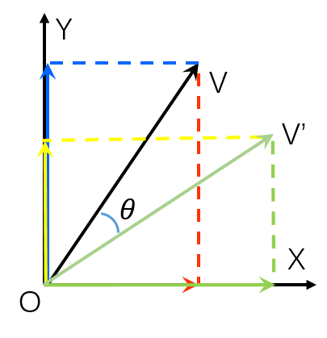

# 奇异值分解（SVD）原理详解及推导

​		SVD（Singular Value Decomposition）是线性代数中一种重要的矩阵分解，在某些方面与对称矩阵基于特征向量的对角化类似。在数据降维和矩阵压缩存储方面有着重要的应用。

## 正交矩阵

​		首先从正交矩阵的变换入手，考察矩阵乘法的本质，由图中可见对于矩阵的乘法，即可以看做行向量向列向量的内积，也可以看做是对列向量的线性组合。

图1

​		假设 XOY 平面上有向量 $\vec{OV}=(V_x,V_y)^T$ ，现将 XOY 坐标系逆时针旋转 $\theta$ °得到 X'OY' 坐标系，则，在新坐标系下 $\vec{OV}$ 的坐标 $(V'_x,V'_y)^T$ ，可表示为 $(V'_x,V'_y)^T=A(V_x,V_y)^T$，其中 A 如下图所示，是一个单位正交矩阵。

图2

​		从 图2 中可以看出，$(V'_x,V'_y)^T$ 是 $\vec{OV}$  向量在新坐标系的基向量 $\vec{OX'}$ 和 $\vec{OY'}$ 上的投影，但因为这两个基向量都是单位向量，因此任何向量在与其的内积就是该向量在这个方向上的投影值。因此不难从 图1 矩阵乘法的几何意义中发现，实际上 $(a_{11},a_{12})$ 就是 $\vec{OX'}$ 在 XOY 坐标系下的表述， $(a_{21},a_{22})$ 就是 $\vec{OY'}$ 在 XOY 坐标系下的表述。

​		此外，由于 $(V_x,V_y)^T$ 本身又是 $\vec{OV}$ 在原始坐标系 $\vec{OX}$ 和 $\vec{OY}$ 上的投影，把 图2 的变换公式从 图1 中线性组合的角度来看，向量 $(a_{11},a_{21})^T$ 即是 $\vec{OX}$ 在 X‘OY’ 坐标系下的表述， $(a_{12},a_{22})$ 就是 $\vec{OY}$ 在 X'OY' 坐标系下的表述。

​		于是根据旋转角度可以推出 A ：
$$
A=
\left[\begin{matrix}
\cos\theta & sin\theta\\
-\sin\theta & \cos\theta
\end{matrix}\right]
$$

​		注意此时的观察方式是：坐标系按逆时针旋转 $\theta$ ° ，对应的也可以理解为保持坐标系不变，向量 $\vec{OV}$ 顺时针旋转了相同的角度。

​		对于变换矩阵 A 而言，当要以后一种描述时，即：向量 $\vec{OV}$ 顺时针旋转角度 $\theta$  或者 向量 $\vec{OV}$ 逆时针旋转角度 $\theta'=(2\pi-\theta)$ ，因此，当默认是向量旋转，且旋转方向为逆时针时，变换矩阵  $A(\theta)$ 变为 $A(\theta')$ （这是 A 矩阵的另外一种形式）
$$
A=
\left[\begin{matrix}
\cos\theta & -sin\theta\\
\sin\theta & \cos\theta
\end{matrix}\right]
$$

## 特征值分解 EVD

​		在开始讨论 SVD 之前，首先讨论矩阵的特征值分解（EVD），选择对称阵——它总能对角化，并且不同特征值对应的特征向量两两正交。假设存在满秩对称阵 $A_{m\times m}$ ，它有 m 个不同的特征值，$\lambda_i(i=1,2,\dots m)$ ，对应的单位特征向量为 $x_i(i=1,2,\dots m)$ 。则有：
$$
Ax_1=\lambda_1x_1\\
Ax_2=\lambda_2x_2\\
\vdots\\
Ax_m=\lambda_mx_m\\
$$
​		进而可以写成
$$
AU=U\Lambda\\
U=[x_1\ x_2\ \dots\ x_m]\\
\Lambda=\left[\begin{matrix}
\lambda_1 & \dots & 0\\
\vdots & \ddots & \vdots\\
0 & \dots & \lambda_m
\end{matrix}\right]
$$
​		于是可以得到（因为 U 是单位正交阵）
$$
A=U\Lambda U^{-1}=U\Lambda U^T
$$
