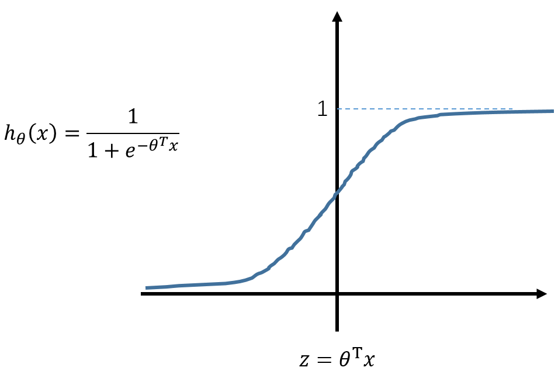
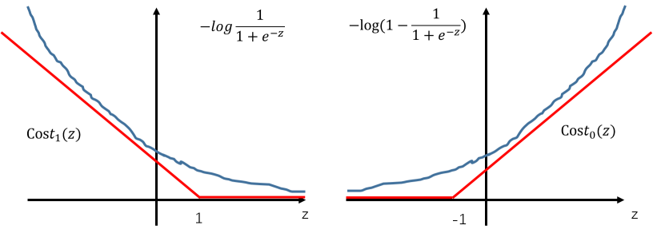
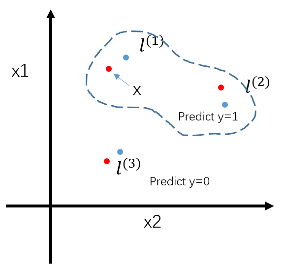
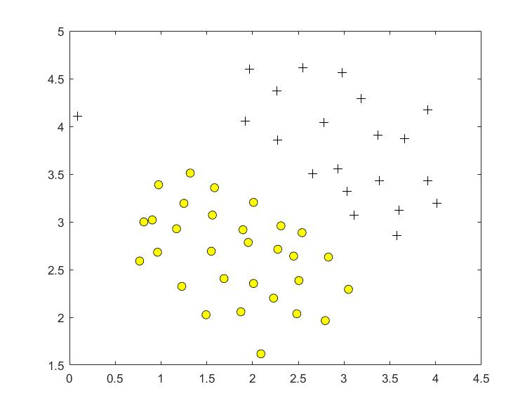
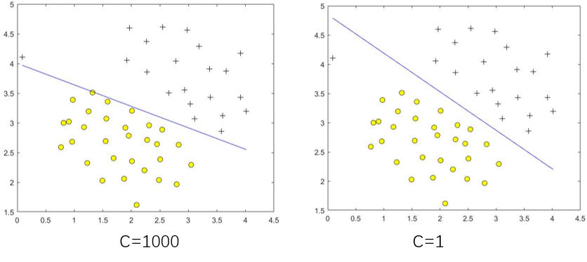
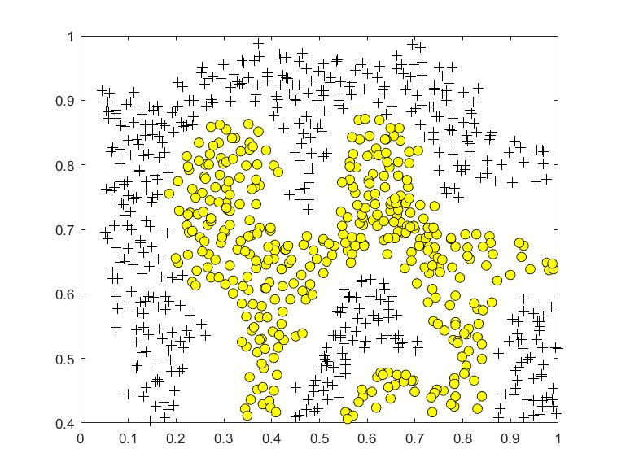
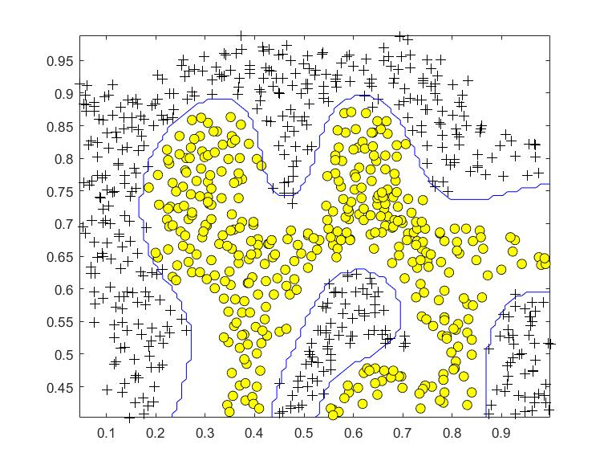

# 支持向量机

​		支持向量机（support vector machine）是一种对样本进行分类的算法，与逻辑回归在某种程度上有一定的相似性。与之不同的是，支持向量机会在样本之间 “容忍性” 最好的一个超平面。所谓 “容忍性” 最好是指该超平面到两个分类的样本距离会尽量大。如图中所，虽然三条实线都可以对两个分类的样本进行划分，但对于支持向量机而言更有可能选择红色实线。

## 优化目标

​		首先从逻辑回归的非线性函数 sigmoid 函数说起：

​		对于逻辑回归时的一个样本而言，当 y=1 时， 我们希望 $h_\theta(x)\approx 1,\quad\theta^T\gg 0$ ， 当 y=0 时，我们希望 $h_\theta(x)\approx0,\quad \theta^Tx\ll0$  ，此时逻辑回归的 Cost Function （对于一个样本）：
$$
\left.\begin{aligned}
  & -(y\log h_\theta(x) + (1-y)\log (1-h_\theta(x)))\\
= & -y\log \frac{1}{1+e^{-\theta^Tx}} - (1-y) \log(1-\frac{1}{1+e^{\theta^Tx}})
\end{aligned}\right.
$$
​		将这两个部分分开来看，下图中蓝色的线是逻辑回归的代价函数，对于逻辑回归我们只考虑 $\theta^Tx$ 的符号，若大于零则预测为 1 ， 小于零则预测为 0 。

​		在支持向量机中我们希望这个边界条件更强一些，对于 $\theta^Tx$ ，当大于 1 时才预测为 1 （此时对应左图 cost function 为 0 即不惩罚）， 当小于 1 时才预测为 0 。并且，相对于逻辑回归的 Cost Function 是非线性的，支持向量机在决策边界之外的部分采用线性函数，这样会大大提高求导速度以及支持向量机的效率。

​		因此，支持向量机的 Cost Function 形式：
$$
\min_\theta C\sum_{i=1}^{m}[y^{(i)}cost_1(\theta^Tx^{(i)})+(1-y^{(i)})cost_0(\theta^Tx^{(i)})]+\frac{1}{2}\sum_{i=1}^n\theta^2
$$
注意该式的第二项任然是正则化项，但正则化系数 C 乘在了第一项上，可以理解为 $C=\frac{1}{\lambda}$ 

## 大间隔分类的数学原理

​		回到（1）式，可以这样理解，即要寻找一个 $\theta$ 使得（1）式达到最小值，因而这个 $\theta$ 是变动的，可选的，只能能达到最小化（1）的目标，任何 $\theta$ 都可以。这样一来，对于一个某一个类别 y=1 的样本而言，（1）式前半部分只有 cost1 起作用，此时挑选 $\theta$ 使得 $\theta^Tx\ge1$ 则可以让前半部分为 0 。观察（1）可以发现前半部分起到分类的作用，即一旦分类预测错误产生的惩罚由前半部分表示，此时也就不难考虑 C 的作用： 当 C 取一个很大的值时，即意味着预测错误时产生的惩罚很大，算法会尽量使得每一个样本分类正确，因而会产生类似过拟合的效果，对误差样本的包容性不好。 

​		假设我们的 C 值较大，表示算法主要还是以分类准确为主，（即分类预测错误产生的惩罚会远大于后面正则化项的惩罚，需要优先考虑），因此，（1）式就可以转化为以下形式的优化问题：
$$
\left . \begin{aligned}
& min \quad\frac{1}{2}\sum_{j=1}^n \theta^2_j\\
& s.t. \quad\theta^Tx^{(i)}\ge1 \quad if\ y^{(i)}=1\\
& \quad\quad\ \ \  \theta^Tx^{(i)}\le-1 \quad if\ y^{(i)}=0
\end{aligned}\right. \tag {*}
$$
​		为了理解为什么支持向量机能够完成大间隔分类的任务，先从向量内积说起。对于 u、v两个向量，其内积等于二者坐标对应相乘相加，几何定义为 $\vec{u}\sdot\vec v=||\vec u||\sdot||\vec v||\sdot\cos(\vec u, \vec v)$ ，其中定义 $p = ||\vec u||\sdot\cos(\vec u, \vec v)$ （即 u 向 v 的投影量） 。如果 u、v 为两个列向量，则此时二者内积定义为 $u^Tv=p\sdot||v||$ ，两道竖线代表向量的模长。于是（*）式即可改写为：
$$
\left . \begin{aligned}
& min \quad\frac{1}{2}||\theta||^2\\
& s.t. \quad p^{(i)}\sdot||\theta||\ge1 \quad if\ y^{(i)}=1\\
& \quad\quad\ \ \  p^{(i)}\sdot||\theta||\le-1 \quad if\ y^{(i)}=0
\end{aligned}\right. \tag {**}
$$

​		将 $\theta$ 视为一个向量， $p^{(i)}$ 表示第 i 个样本在向量在 $\theta$ 方向上的投影，于是（**）表达的最优化问题即为在满足分类正确（或者大部分样本分类正确）得前下，使得 $\theta$ 的模长最小。

​		注意，由于将 $\theta$ 视为一个向量，由本节的第一幅图可以看出实际上的决策边界是三条红色的线，其中两条虚线表示  $\theta^Tx=\pm1$ 红色实线表示  $\theta^Tx=0$ ，我们通常还是将  $\theta^Tx=0$  作为决策边界。因此，作为决策边界的线（三维空间中是面） x 是与 $\theta$ 垂直的。

​		于是从下图中更加直观的理解大间隔分类：

​		假设样本分布如图所示，如果决策边界（红线）选择了左边，p1、p2分别是两个样本在 $\theta$ 上的投影，可以看出此时的 p1、p2都比较小，于是为了能够正确分类，（**）中 $\theta$ 的模就会很大以达到 s.t. 的约束。但是如果决策边界是右图的话 p1、p2本身就比较大，此时就能够取得更小的 $\theta$ 。这就是支持向量机能够形成类似右图的决策边界的原因，实质上是由优化的目标函数所决定的。

## 核函数

​		以上所讨论样本分布都是可以用一个超平面来切分的，如果是非线性的决策边界呢？在逻辑回归中使用了多项式回归解决这一问题：

$$
\theta_0+\theta_1x_1+\theta_2x_2+\theta_3x_1x_2+\theta_4x_1^2+\theta_5x_2^2\dots
$$
​		但在实际处理中我们依然考虑成线性回归的形式：
$$
\theta_0+\theta_1f_1+\theta_2f_2+\theta_3f_3+\theta_4f_4+\theta_5f_5\dots\\ f_1=x_1,f_2=x_2,f_3=x_1x_2,f_4=x_1^2,f_5=x_2^2\dots
$$
​		显然 f 可以看做是由 x 得到的更加复杂的特征形式，在支持向量机中使用的 f 与（3）式不尽相同，首先在平面上定义一些标记点（landmarks） $l^{(1)},l^{(2)},l^{(3)},\dots$ 

​		对于一个给定的样本（在平面上维度与 l 一致），定义 f :
$$
f_1 = similarity(x,l^{(1)})=\exp(-\frac{||x-l^{(1)}||}{2\sigma^2})\\
f_2 = similarity(x,l^{(2)})=\exp(-\frac{||x-l^{(2)}||}{2\sigma^2})\\
f_3 = similarity(x,l^{(3)})=\exp(-\frac{||x-l^{(3)}||}{2\sigma^2})\\
...
$$
​		此时 f 是一个用于描述样本 x 和 标记点 l 之间相似度的函数，称为核函数，这里的核函数实际上就是高斯函数。它具有这样的性质：当 x 和 l 十分相近时，f 的值接近于 1 ，反之则接近于 0 。下面通过一个例子理解核函数的作用：

​		图中的蓝点表示标记点，红点表示样本点，假设我们已经得到一个SVM形式如下：
$$
\left.\begin{aligned}
& h = \theta_0+\theta_1f_1+\theta_2f_2+\theta_3f_3\\
& f_i = similarity(x,l^{(i)})\\
& \theta_0=-0.5,\quad\theta_1=1,\quad\theta_2=1,\quad\theta_3=0\\
& predict\quad y=1 \quad when \quad h \ge 0\\
& predict\quad y=0 \quad when \quad h \lt 0\\
\end{aligned}\right.
$$
​		所以，对于图中标记出的样本点 x ，由于十分接近 $l^{(1)}$ ，因而 $f_1\approx 1,f_2\approx 0,f_3\approx 0\rightarrow h=0.5\ge0$ ，因此 x 的预测值为 1 。另外两个点同样的分析方法可知靠近 $l^{(2)}$ 的 x 都会被预测为 1 ， 靠近 $l^{(3)}$的 x 会被预测为 0，最终得到一条大概的决策边界。

​		由此可见标记点决定了最终SVM的决策边界，在实际问题中，通常就以所有的样本点作为标记点，假设共有 m 个样本点，即
$$
f_1 = similarity(x,x^{(1)})\\
f_2 = similarity(x,x^{(2)})\\
...\\
f_m = similarity(x,x^{(m)})
$$
​		对于训练数据而言：
$$
x^{(i)}\rightarrow
\left.\begin{matrix}
f_1^{(i)} = similarity(x^{(i)},x^{(1)})\\
f_2^{(i)} = similarity(x^{(i)},x^{(2)})\\
\vdots\\
f_i^{(i)} = similarity(x^{(i)},x^{(i)})=1\\
\vdots\\
f_m^{(i)} = similarity(x^{(i)},x^{(m)})
\end{matrix}\right.
$$
​		组织训练数据 x 为矩阵形式（每个样本为一行），则经过 f 函数映射后的新的特征矩阵 F 是一个对角线元素全为 1 的 $m\times m$ （f 的个数由样本数决定）实对称方阵。由于在和 $\theta$ 相乘时还有一项常数项 $\theta_0$ 故还需要为 F 第一列添加 1 ，此时的 f 长度为 m+1 。相应的 $\theta$ 的维度也是 m+1 。于是，最终的优化目标的形式：
$$
\min_\theta C\sum_{i=1}^{m}[y^{(i)}cost_1(\theta^Tf^{(i)})+(1-y^{(i)})cost_0(\theta^Tf^{(i)})]+\frac{1}{2}\sum_{i=1}^m\theta^2
$$
​		另外值得一提的是，关于核函数，也可以取别的，比如最简单的线性核，选择核函数为别的评价两点相似度的函数 $||x-l^{(i)}||^2$ 也是可行的。需要说明的是对于（7）式的优化问题已有很多方法和算法，可参考二次规划方法以及SMO方法等，此处不再引申。

 

## 应用实例

​		程序：machine-learning-ex6/ex6/ex6.m

​		文档：machine-learning-ex6/ex6.pdf

+ 原始数据分布：注意到左上部分有一个误差样本

+ SVM分类结果

​		可见，当 C 较大时模型分类错误的惩罚非常大，因此会迫使算法尽量使得每一个样本分类正确由此可产生过拟合结果， C 较小时由于分类错误的惩罚变小，算法趋向于选择最小模长的 $\theta$ 。

+ 样例二：非线性问题

+ 使用高斯核函数的分类结果

​		代码中 ex6_spam.m 是一个使用SVM进行垃圾邮件分类的任务，其目标和具体过程在 ex6.pdf 中有详细说明，不再赘述。