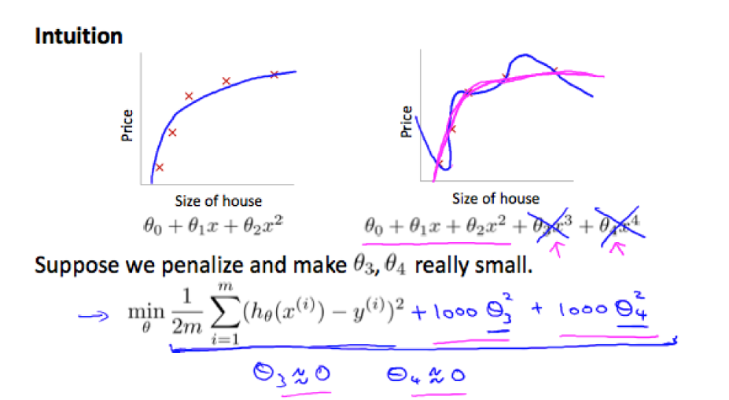
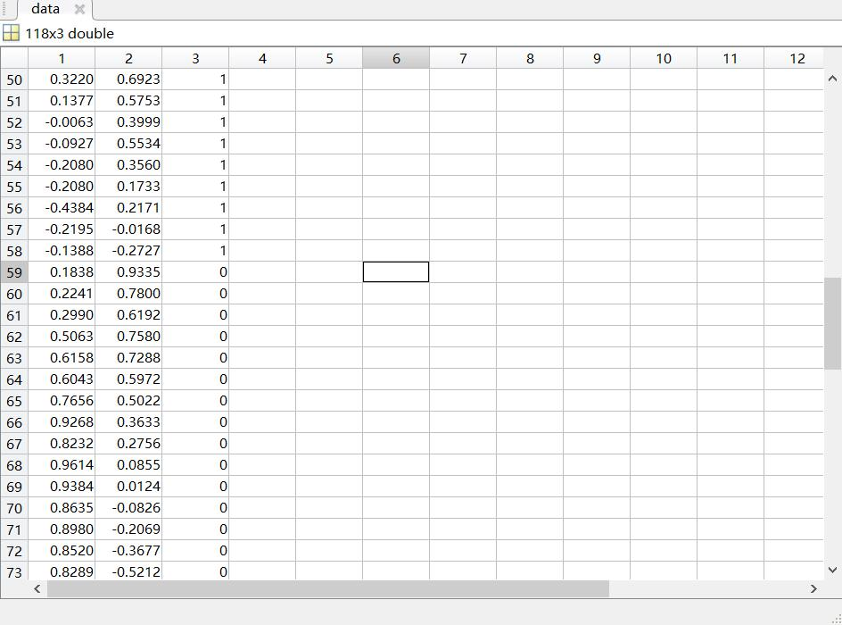
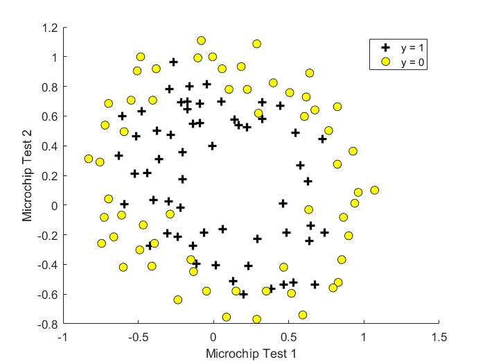
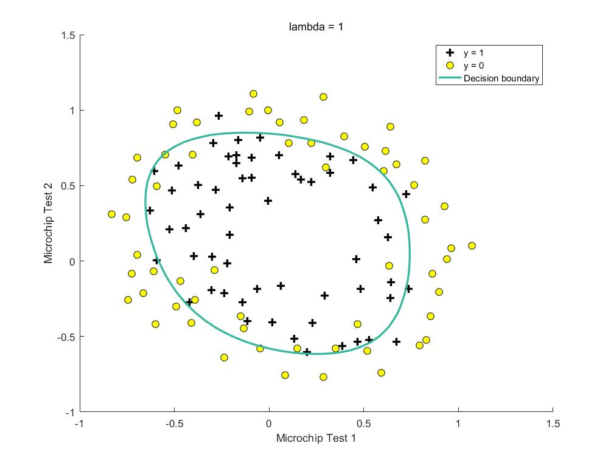
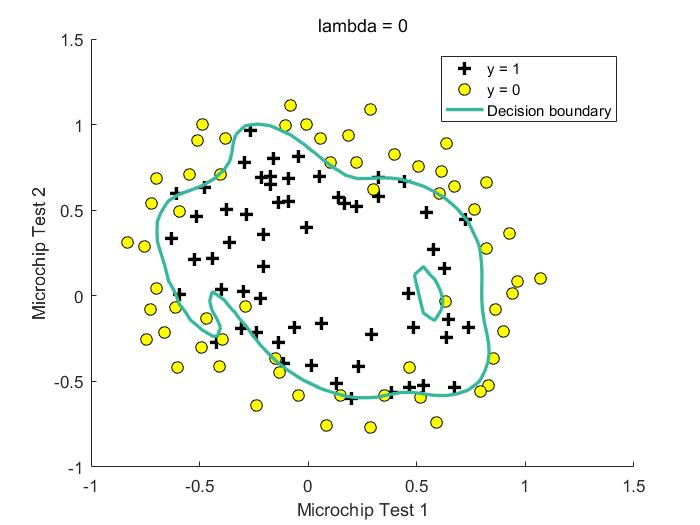
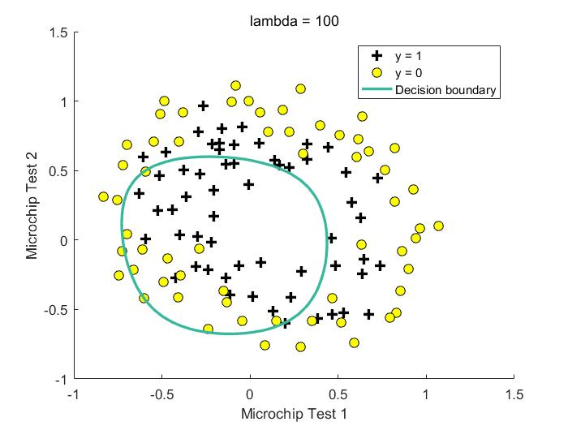

# 正则化

​	在实际的回归问题中，模型的表现好坏取决于假设函数的设计，对于同一组数据，不同的模型参数会得到不一样结果，如下图所示：


​	图中从左到右分的模型分别是：$y=\theta_0+\theta_1x$, $y=\theta_0+\theta_1x+\theta_2x^2$, 和 $y=\sum_{j=0}^{5}\theta_jx^j$ , 可以看出在增加特征数量，提高模型阶数时，对数据细节的拟合效果会越来越好，但与此同时，由于训练样本的误差会使得模型的泛化能力变差。这样的模型仅仅在训练数据上有着较好的表现，而实际测试中效果不好。对于图一的情况叫做欠拟合（underfitting），图三叫做过拟合（overfitting）。

​	当某个问题中特征维度太大时即可能出现过拟合的现象，解决的方法包括以下两种：

1. 减少特征数目：筛选掉一部分的特征
2. 正则化：保留所有的特征，但减小该项特征的系数 $\theta_j$ 


+ ## 代价函数（Cost Function）

​	为了避免最后的结果产生过拟合现象，我们可以尽量减小高次项的系数，通过将该系数添加到代价函数中。

​	假定我们的预测函数模型为：
$$
\theta_0+\theta_1x+\theta_2x^2+\theta_3x^3+\theta_4x^4
$$
​	我们希望能够限制三次项和四次项对最后预测结果的占比，通过某些方法来实现而非把三次项和四次项剔除。可以修改之前的代价函数：
$$
min_\theta\ \frac{1}{2m}\sum_{i=1}^{m}(h_\theta(x^{(i)})-y^{(i)})^2+1000\sdot\theta_3^2+1000\sdot\theta_4^2
$$
​	我们在代价函数中增加了额外的两项，现在，为了使得代价函数最小，最后形成的模型会使得 $\theta_3$ 和 $\theta_4$  尽量小。



​	最后给出通用的cost function形式：
$$
min_\theta\ \frac{1}{2m}\sum_{i=1}^{m}(h_\theta(x^{(i)}-y^{(i)}))^2+\lambda\sum_{j=1}^{n}\theta_j^2
$$


+ ## 梯度下降法

​	由（3）式易求其对 $\theta_j$ 的偏导数，但是需注意的是，一般情况下对于 $\theta_0$ 不进行正则化。因此 $\theta$ 的更新公式如下：
$$
Repeat\{\\
\theta_0 = \theta_0-\alpha\frac{1}{m}\sum_{i=1}^{m}(h_\theta(x^{(i)})-y^{(i)})x_j^{(i)}\\
\theta_j = \theta_j-\alpha[(\frac{1}{m}\sum_{i=1}^{m}(h_\theta(x^{(i)})-y^{(i)})x_j^{(i)})+\frac{\lambda}{m}\theta_j]\quad\quad\quad j\in\{1,2,\dots,n\}\\
\}\quad\quad\quad\quad\quad\quad\quad\quad\quad\quad\quad\quad\quad\quad\quad\quad\quad\quad\quad\quad\quad\quad\quad\quad\quad\quad\quad\quad\quad\quad\quad\quad
$$
​	其中，$\frac{\lambda}{m}\theta_j$ 叫做正则项，同时，该式还可以化简为：
$$
\theta_j=\theta_j(1-\alpha\frac{\lambda}{m})-\alpha\frac{1}{m}\sum_{i=1}^{m}(h_\theta(x^{(i)})-y^{(i)})x_j^{(i)}
$$


+ ## 应用实例

  ​	程序：\machine-learning-ex2\ex2_reg.m

  ​	文档：\machine-learning-ex2\ex2.pdf

  ​	数据分布情况：该实例中的数据分布为非线性关系

  

  

  

### 生成高次特征：

```matlab
function out = mapFeature(X1, X2)
% MAPFEATURE Feature mapping function to polynomial features
%
%   MAPFEATURE(X1, X2) maps the two input features
%   to quadratic features used in the regularization exercise.
%
%   Returns a new feature array with more features, comprising of 
%   X1, X2, X1.^2, X2.^2, X1*X2, X1*X2.^2, etc..
%
%   Inputs X1, X2 must be the same size
%

degree = 6;
out = ones(size(X1(:,1)));
for i = 1:degree
    for j = 0:i
        out(:, end+1) = (X1.^(i-j)).*(X2.^j);
    end
end

end
```


### CostFunction：

​	注意此处的代价函数是对应于Logistic回归的，导数项同理：

```matlab
function [J, grad] = costFunctionReg(theta, X, y, lambda)
%COSTFUNCTIONREG Compute cost and gradient for logistic regression with regularization
%   J = COSTFUNCTIONREG(theta, X, y, lambda) computes the cost of using
%   theta as the parameter for regularized logistic regression and the
%   gradient of the cost w.r.t. to the parameters. 

% Initialize some useful values
m = length(y); % number of training examples

% You need to return the following variables correctly 
J = 0;
grad = zeros(size(theta));

% ====================== YOUR CODE HERE ======================
% Instructions: Compute the cost of a particular choice of theta.
%               You should set J to the cost.
%               Compute the partial derivatives and set grad to the partial
%               derivatives of the cost w.r.t. each parameter in theta

h = sigmoid(X*theta);

J = mean(-y.*log(h)-(1-y).*log(1-h))+lambda/(2*m)*(sum(theta.^2)-theta(1).^2);

grad(1) = mean((h-y).*X(:,1));

for j=2:size(theta,1)
    grad(j) = mean((h-y).*X(:,j)) + lambda/m*theta(j);
end

% =============================================================

end
```

结果（ $\lambda=1$ ）：




（ $\lambda=0$ ）:



（ $\lambda=1​$ ）:



可以比较出不同的正则化系数对最后拟合效果影响。


* ## 数据可视化

​	上一节中已经提到了如何在matlab中将样本点的分布情况绘制出来，这里将说明Logistic回归中决策边界的绘制。

```matlab
function plotDecisionBoundary(theta, X, y)
%PLOTDECISIONBOUNDARY Plots the data points X and y into a new figure with
%the decision boundary defined by theta
%   PLOTDECISIONBOUNDARY(theta, X,y) plots the data points with + for the 
%   positive examples and o for the negative examples. X is assumed to be 
%   a either 
%   1) Mx3 matrix, where the first column is an all-ones column for the 
%      intercept.
%   2) MxN, N>3 matrix, where the first column is all-ones

% Plot Data
plotData(X(:,2:3), y);
hold on

if size(X, 2) <= 3
    % Only need 2 points to define a line, so choose two endpoints
    plot_x = [min(X(:,2))-2,  max(X(:,2))+2];

    % Calculate the decision boundary line
    plot_y = (-1./theta(3)).*(theta(2).*plot_x + theta(1));

    % Plot, and adjust axes for better viewing
    plot(plot_x, plot_y)
    
    % Legend, specific for the exercise
    legend('Admitted', 'Not admitted', 'Decision Boundary')
    axis([30, 100, 30, 100])
else
    % Here is the grid range
    u = linspace(-1, 1.5, 50);  % -1:1.5 number of item is 50
    v = linspace(-1, 1.5, 50);

    z = zeros(length(u), length(v));
    % Evaluate z = theta*x over the grid
    for i = 1:length(u)
        for j = 1:length(v)
            z(i,j) = mapFeature(u(i), v(j))*theta;
        end
    end
    z = z'; % important to transpose z before calling contour

    % Plot z = 0
    % Notice you need to specify the range [0, 0]
    contour(u, v, z, [0, 0], 'LineWidth', 2)
% contour(u, v, z, 'LineWidth', 2)
end
hold off

end

```

