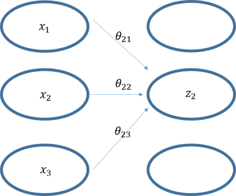

# 神经网络参数及反向传播算法（二）

​		上一节推导的神经网络反向传播算法基于的 cost function 为均方误差函数，实际应用中，参考 Logistic 回归的形式定义的 cost function 和均方误差形式有所区别，下图是本节的示例网络。

图1

​		如图所示的是一个包含了两个隐层的神经网络（仅画出了一条连接线，其余省略），用 l 标识层号，第一层为输入层包含了 n 个结点，结点序号用 p 标识。第二层，第三层为隐层分别有 n1 ， n2 个结点，结点的序号用 i ， j 标识。第四层为输出层包含 n3 个输出结点， 节点序号用 k 标识。每一层之间的连接权值用 $\theta_{ij}^l$ 表示， l 表示序号， i 表示后一层的结点序号， j 表示前一层的结点序号。假设样本空间仅包含一个样例 X ，则$x_1\dots x_n$ 为该样例的各个特征， $y_1\dots y_{n3}$ 为该样例的标签。令神经网络中的 $x_p=a_p^{1}$ 则 对于图中所有的 $z_j^l=\sum_{i=0}^{L}a_i^{l-1}\theta_{ji}^{l-1}$ （此处的 i , j 仅做标识，不与上图中对应，i 表示 j 的上一层， $l$ 表示层号，L表示第 i 层的总结点数目） ，图中的 $a_j^l=sigmoid(z_j^{l})$ 。

## Cost Function

​		Logistic 回归的 cost function：
$$
J(\theta)=-\frac{1}{m}\sum_{i=1}^m[y^{(i)}\log(h_\theta(x^{i}))+(1-y^{(i)})\log(1-h_\theta(x^{(i)}))]+\frac{\lambda}{2m}\sum_{j=1}^{n}\theta_j^2
$$
​		对于神经网络而言，先定义符号：
$$
L\ =\ total\ number\ of\ layers\ in\ the\ network\\
sl\ = \ number\ of\ units\ (not\ counting\ bias\ units)\ in\ layer\ l\\
K\ =\ number\ if\ output\ units/classes\quad\quad\quad\quad\quad\quad\quad\quad\quad\quad\\
$$
​		Cost Function 的形式会更复杂一些：
$$
J(\theta)=-\frac{1}{m}\sum_{i=1}^m\sum_{k=1}^{K}[y_k^{(i)}\log(h_\theta(x^{i})_k)+(1-y^{(i)}_k)\log(1-h_\theta(x^{(i)})_k)]+\frac{\lambda}{2m}\sum_{l=1}^{L-1}\sum_{i=1}^{sl}\sum_{j=1}^{sl+1}(\theta_{j,i}^{(l)})^2
$$
​		相比于 Logistic 回归的 cost function ，（3）式的前半部分增加了一个嵌套的累加，对应着神经网络输出层的所有结点，后半部分则是神经网络的所有权值的平方和构成的正则项。本文的推导将使用不包括正则项的 Cost Function 。
$$
J(\theta)=-\frac{1}{m}\sum_{i=1}^m\sum_{k=1}^{K}[y_k^{(i)}\log(h_\theta(x^{i})_k)+(1-y^{(i)}_k)\log(1-h_\theta(x^{(i)})_k)]
$$

## 结论写在前面

​		神经网络参数想要更新的关键在于对 Cost Function 以及相应偏导数的计算：
$$
J(\theta)\\
\frac{\partial}{\partial \theta_{i,j}^{(l)}}J(\theta)
$$
​		$J(\theta)$ 由（4）式计算，偏导数项在此先给出最终形式，证明和推导在后（参照（2）式的符号定义）：
$$
\frac{\partial}{\partial \theta_{i,j}^{(l)}}J(\theta)=a_j^{(l)}\delta_i^{(l+1)}\\
\delta_i^{l}=\left\{
\begin{aligned}
\delta_i^{L}= & a_i^{(L)}-y_i\\
\delta_i^{l}= & (\sum_{p=1}^{sl}\delta^{l+1}_p\theta_{pi}^{l})a_i^{l}(1-a_i^{l})
\end{aligned}
\right. \tag{*}
$$
​		

## 几点说明

（6）式说明，对于最后一层的 $\delta$ 直接用预测值和标签值相减即可，非最后一层的则照第二种情况计算。此外，对于 $\delta$ 还有矩阵形式的计算公式：
$$
\delta^{(l)} = (\Theta^{(l)})^T\delta^{(l+1)}.*a^{(l)}.*(1-a^{(l)})\quad l<L
$$
​		” .* “ 表示矩阵元素对应相乘。

​		说明：因为 $\Theta$ 为 $\theta$ 的矩阵，形式为：
$$
\Theta=\left[\begin{matrix}
\theta_{11}&\theta_{12}&\dots&\theta_{1n}\\
\theta_{21}&\theta_{22}&\dots&\theta_{2n}\\
\vdots&\vdots&\ddots&\vdots\\
\theta_{m1}&\theta_{m2}&\dots&\theta_{mn}\\
\end{matrix}\right]
$$
​		行表示为前一层神经网络的结点数目，列表示为后一层的结点数目，也就是说，每行对应后一层的一个神经元。考虑前向传播算法：
$$
Z=\left[\begin{matrix}
\theta_{11}&\theta_{12}&\dots&\theta_{1n}\\
\theta_{21}&\theta_{22}&\dots&\theta_{2n}\\
\vdots&\vdots&\ddots&\vdots\\
\theta_{m1}&\theta_{m2}&\dots&\theta_{mn}\\
\end{matrix}\right]
\left[\begin{matrix}
x_1\\
x_2\\
\vdots\\
x_n
\end{matrix}\right]
=
\left[\begin{matrix}
z_1\\
z_2\\
\vdots\\
z_m
\end{matrix}\right]
$$
​		实际上对于 $\delta$ 而言，其维度和 Z 是一致的，并且参照（*）式，累加符号的下标是按照 $\theta$

的列进行循环的，因而 （6）式中需要乘的是 $\Theta$ 的转置。

​		直观来说，观察 图2 前向传播计算，可以看出 $\theta$ 下标是固定行不动，列循环的。

图2

​		对比 图3 中的反向传播算法不难发现 $\theta$ 是固定列不动，行循环的。

图3

## 证明

​		

​		以 图1 的网络为例，证明（*）式。当只有一个样本时， （4）式退化为：
$$
J(\theta)=-\sum_{k=1}^{K}[y_k\log(a_k^4)+(1-y_k)\log(1-a_k^4)]
$$

* $\theta_{kj}^3$ 的偏导数

  由 “神经网络参数及反向传播算法（一）“（7）式可知 

$$
\frac{\partial a_k^4}{\partial z_k^4}=(a_k^4\sdot(1-a_k^4))
$$

​		因此，
$$
\left.\begin{aligned}
\frac{\partial J(\theta)}{\partial \theta_{kj}^3}
= & \frac{\partial J(\theta)}{\partial a_k^4}\sdot \frac{\partial a_k^4}{\partial z_k^4} \sdot \frac{\partial z_k^4}{\partial \theta_{kj}^3}\\
= & -(y_k\sdot\frac{1}{a_k^4}+(1-y_k)\frac{1}{1-a_k^4})\frac{\partial a_k^4}{\partial z_k^4} \sdot \frac{\partial z_k^4}{\partial \theta_{kj}^3}\\
= & -(y_k\sdot\frac{1}{a_k^4}+(1-y_k)\frac{1}{1-a_k^4})(a_k^4\sdot(1-a_k^4))\frac{\partial z_k^4}{\partial \theta_{kj}^3}\\
= & (a_k^4-y_k)a_j^3\\\\
= & \delta_k^4a_j^3
\end{aligned}\right. \tag{**}
$$

* $\theta_{ji}^2$ 的偏导数

$$
\left.\begin{aligned}
\frac{\partial J(\theta)}{\partial \theta_{ji}^2}
= & \sum_{k=1}^{n_3} \frac{\partial J(\theta)}{\partial a_k^4}\sdot \frac{\partial a_k^4}{\partial z_k^4} \sdot \frac{\partial z_k^4}{\partial a_j^3} \sdot \frac{\partial a_j^3}{\partial z_j^3} \sdot \frac{\partial z_j^3}{\partial \theta_{ji}^2}\\
= & \sum_{k=1}^{n_3} (a_k^4-y_k) \frac{\partial z_k^4}{\partial a_j^3} \sdot \frac{\partial a_j^3}{\partial z_j^3} \sdot \frac{\partial z_j^3}{\partial \theta_{ji}^2} \\
= & \sum_{k=1}^{n_3} (a_k^4-y_k) \theta_{ki}^3 \sdot \frac{\partial a_j^3}{\partial z_j^3} \sdot \frac{\partial z_j^3}{\partial \theta_{ji}^2} \\
= & \sum_{k=1}^{n_3} (a_k^4-y_k) \theta_{ki}^3 \sdot a_j^3(1-a_j^3) \sdot \frac{\partial z_j^3}{\partial \theta_{ji}^2} \\
= & \sum_{k=1}^{n_3} (a_k^4-y_k) \theta_{ki}^3 \sdot a_j^3(1-a_j^3) \sdot a_i^2 \\
= & \delta_j^3 \sdot a_i^2 \\ 
\end{aligned}\right. \tag{***}
$$

​		由（\*\*）、（\*\*\*）式联立可得：
$$
\delta_i^{l}=\left\{
\begin{aligned}
\delta_i^{L}= & a_i^{(L)}-y_i\\
\delta_i^{l}= & (\sum_{p=1}^{sl}\delta^{l+1}_p\theta_{pi}^{l})a_i^{l}(1-a_i^{l})
\end{aligned}
\right.
$$
或者其矩阵形式：
$$
\delta^{(l)} = (\Theta^{(l)})^T\delta^{(l+1)}.*a^{(l)}.*(1-a^{(l)})\quad l<L
$$

 