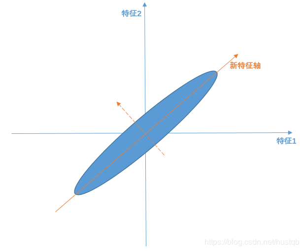
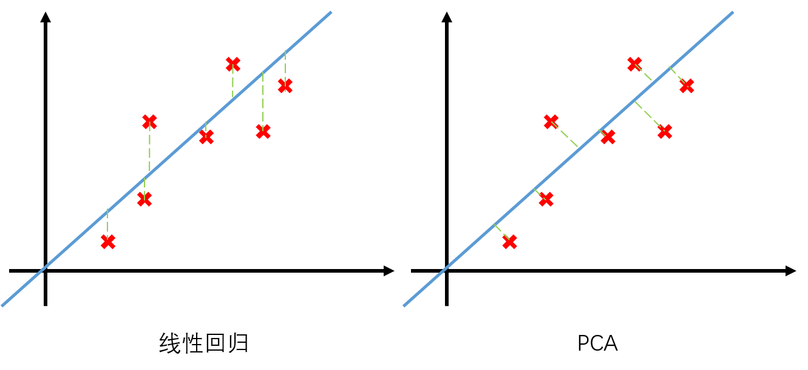
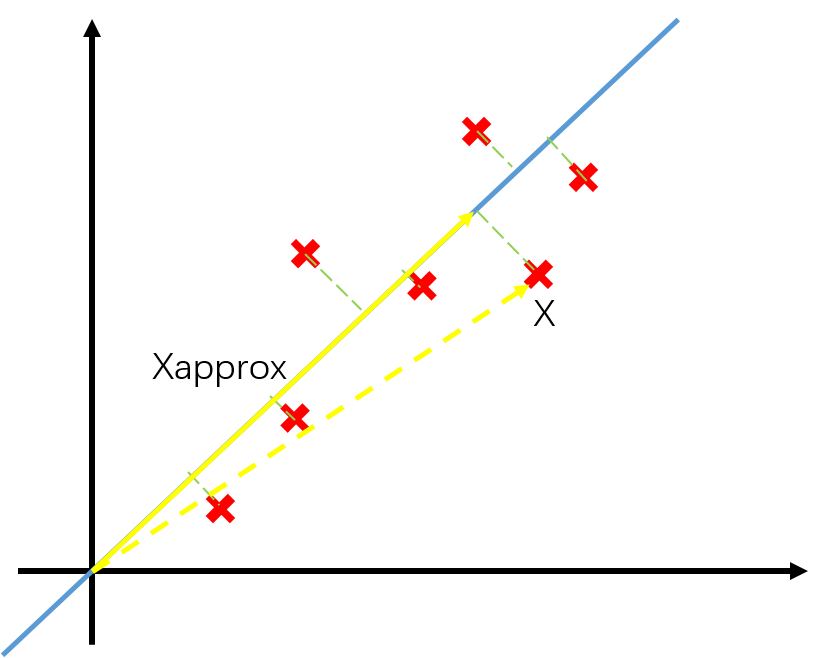

# 降维（PAC）

​		很多时候，在机器学习的任务中，常常因为样本的特征维度太高而使得神经网络结构非常复杂，可能导致网络训练的周期很长，且由于维度太大，也增加了过拟合的风险。实际上，在任务中很有可能对于样本点的特征维度，某些信息是冗余重复的。比如，在房价预测的例子中，描述房子的特征可能包括了：房间的面积 $s^2$, 房间数目 $n$，房间大小 $feet^2$ ... 其中面积和房间大小即是重复的特征。因此，使用 PCA （Principal Component Analysis）算法使得原数据的维度适当减少则可以简化学习任务。

## PCA 原理

>这部分内容摘自https://blog.csdn.net/hustqb/article/details/78394058

​		PCA全称Principal Component Analysis，即主成分分析，是一种常用的数据降维方法。它可以通过线性变换将原始数据变换为一组各维度线性无关的表示，以此来提取数据的主要线性分量。
$$
z = w^Tx
$$
​		其中，z为低维矩阵，x为高维矩阵，w为两者之间的映射关系。假如我们有二维数据（原始数据有两个特征轴——特征1和特征2）如下图所示，样本点分布为斜45°的蓝色椭圆区域。PCA算法认为斜45°为主要线性分量，与之正交的虚线是次要线性分量（应当舍去以达到降维的目的）。

重点：

1. 线性变换=>新特征轴可由原始特征轴线性变换表征
2. 线性无关=>构建的特征轴是正交的
3. 主要线性分量（或者说是主成分）=>方差加大的方向
4. PCA算法的求解就是找到主要线性分量及其表征方式的过程

​		相应的，PCA解释方差并对离群点很敏感：少量原远离中心的点对方差有很大的影响，从而也对特征向量有很大的影响。

### 线性变换

​		一个矩阵与一个列向量A相乘，等到一个新的列向量B，则称该矩阵为列向量A到列向量B的线性变换。

​		我们希望投影后投影值尽可能分散，而这种分散程度，可以用数学上的方差来表述。
$$
Var(a)=\frac{1}{m}\sum_{i=1}^{m}(a_i-u)^2
$$
​		即寻找一个一维基，使得所有数据变换为这个基上的坐标表示后，方差值最大，方差越大，说明数据越分散。通常认为，数据的某个特征维度上数据越分散，该特征越重要。

​		对于更高维度，还有一个问题需要解决，考虑三维降到二维问题。与之前相同，首先我们希望找到一个方向使得投影后方差最大，这样就完成了第一个方向的选择，继而我们选择第二个投影方向。如果我们还是单纯只选择方差最大的方向，很明显，这个方向与第一个方向应该是“几乎重合在一起”，显然这样的维度是没有用的，因此，应该有其他约束条件——就是正交。从直观上说，让两个字段尽可能表示更多的原始信息，我们是不希望它们之间存在（线性）相关性的，因为相关性意味着两个字段不是完全独立，必然存在重复表示的信息。字段在本文中指，降维后的样本的特征轴。

​		数学上可以用两个字段的协方差表示其相关性：
$$
Cov(a,b)=\frac{1}{m}\sum_{i=1}^m(a_i-\mu_a)(b_i-\mu_b)
$$
​		当协方差为0时，表示两个字段线性不相关。

​		总结一下，PCA的优化目标是：
​		**将一组N维向量降为K维（K大于0，小于N），其目标是选择K个单位正交基，使得原始数据变换到这组基上后，各字段两两间协方差为0，而字段的方差则尽可能大。**

​		所以现在的重点是**方差和协方差**。

### 协方差

​		在统计学上，协方差用来刻画两个随机变量之间的相关性，反映的是变量之间的二阶统计特性。考虑两个随机变量 $X_i$ 和 $X_j$，它们的协方差定义为
$$
cov(X_i,X_j)=E[(X_i-E(X_i))(X_j-E(X_j))]
$$
​		注意，对于两个独立随机变量而言，它们的协方差肯定为 0 ， 但是对于两个协方差为 0 的随机变量却不一定独立，只能说它们不相关。（协方差判定的是两个随机变量的线性相关性）。

​		协方差矩阵：

​		假设有 m 个变量，特征维度为 2，$a_1$ 表示变量 1 的 a 特征，那么构成的数据集矩阵为： 
$$
X=
\left(\begin{matrix}
a_1 & a_2 & \dots & a_m \\
b_1 & b_2 & \dots & b_m
\end{matrix}\right)
$$
​		再假设这两个维度上样本值的均值为 0 ，对于两个特征维度均值为 0 的 m 个向量组成的向量组：
$$
\frac{1}{m}XX^T=
\left(\begin{matrix}
\frac{1}{m}\sum_{i=1}^ma_i^2 & \frac{1}{m}\sum_{i=1}^ma_ib_i\\
\frac{1}{m}\sum_{i=1}^ma_ib_i & \frac{1}{m}\sum_{i=1}^mb_i^2
\end{matrix}\right)
$$
​		可以发现对角线上的元素是两个字段的方差，其他元素是两个字段的协方差，两者都被统一到了一个矩阵——协方差矩阵中。

​		**回顾一下前面所说的PCA算法的目标：方差max，协方差min！！**

​		要达到PCA降维目的，等价于将协方差矩阵对角化：即除对角线外的其他元素化为0，并且在对角线上将元素按大小从上到下排列，这样我们就达到了优化目的。

​		设原始数据矩阵X对应的协方差矩阵为C，而P是一组基按行组成的矩阵，设Y=PX，则Y为X对P做基变换后的数据。设Y的协方差矩阵为D，我们推导一下D与C的关系：
$$
D=\frac{1}{m}YY^T=\frac{1}{m}(PX)(PX)^T=\frac{1}{m}PXX^TP^T=P(\frac{1}{m}XX^T)P^T=PCP^T
$$
​		即想让原始数据集 X =>pca 成数据集Y，使得Y的协方差矩阵是个对角矩阵。

有上述推导可得，若有矩阵P能使X的协方差矩阵对角化，则P就是我们要找的PCA变换。

​		优化目标变成了寻找一个矩阵 P ， 满足 $PCP^T$ 是一个对角阵，并且对角线元素按照从大到小排列，那么 P 的前 K 行就是要寻找的基，用 P 的前 K 行组成的矩阵乘 X 就使得 X 从 N 维降到了 K 维并满足上述的优化条件。

### 矩阵对角化

​		首先，原始数据 X 的协方差矩阵是一个实对称阵，它有着特殊的数学性质：

1. 实对称阵不同的特征值对应的特征向量必然正交。
2. 设特征值 $\lambda$ 重数为 r ，则必然存在 r 个线性无关的特征向量对应于 $\lambda$ ，因此可以将这 r 个特征向量单位正交化。

​		一个 n 行 n 列的实对称阵一定是可以找到 n 个单位正交的特征向量的，设它们为 $e_1,e_2,\dots,e_n$ ，我们将其按列排成矩阵：
$$
E = (e_1,e_2,\dots,e_n)
$$
​		则有：
$$
C=E\Lambda E^T\\
\Lambda=
\left(\begin{matrix}
\lambda_1\\
& \lambda_2\\
&& \ddots\\
&&& \lambda_n
\end{matrix}\right)
$$
​		并且 E 是单位正交阵， 即 $E^{-1}=E^T$ ，所以：
$$
E^TCE=\Lambda
$$
​		因此， 对照（7）式 $D=\Lambda,\quad P=E^T$ 。

​		P是协方差矩阵的特征向量单位化后按行排列出的矩阵，其中每一行都是C的一个特征向量。如果设P按照中特征值的从大到小，将特征向量从上到下排列，则用P的前K行组成的矩阵乘以原始数据矩阵X，就得到了我们需要的降维后的数据矩阵Y。

​		关于为什么特征值 $\lambda $ 要从小到排列，为什么要选较大的 $\lambda$ ，是因为协方差矩阵的对角元素是方差，我们希望找到方差较大的特征维度，所以选择较大的对角线元素。而对角阵 $\Lambda$ 虽然是 C 经过线性变换后的矩阵，但它在对角线撒花姑娘元素的大小关系没变，特征维度 i 对应的特征值 $\lambda_i$ 越大，该维度上数据的方差越大。

​		值得一提的是，尽管对对称矩阵（5）做对角化是可以完成 PCA 的，但更多时候为了数值上更加稳定，我们通常对（5）进行的是 SVD 分解，关于 SVD 分解的细节可以参考前面章节。

### PCA 与 线性回归 的区别

​		PCA 和 线性回归都是要找到一个超平面使得所有样本点到这个平面的某种度量之和达到最小，它们看似十分相似，但却有着本质的区别。PCA 算法目这种度量是样本点到达该平面的垂直距离，而对于线性回归，这种度量则是样本点到达这个平面的在坐标轴方向上的距离。下图可以直观的说明 PCA 和线性回归的优化目标的不同。

# PCA 算法实现

​		前面的部分提到，PCA 实现数据降维的关键在于协方差矩阵的对角化以及 K 值的选择，K 值得大小将决定了降维后的数据维度。因此， PCA 算法需要注意的是两个部分，首先，协方差矩阵要能写成 $XX^T$ 或者 $X^TX$ 的形式，必须 X 经过了标准化处理，即其均值为 0 。其次，需要确定合适的 k 值，以避免在降维后丢失太多关键信息。

### K 值选定

​		对 $\frac{1}{m}XX^T$ 做 SVD 分解，$[u,s,v]=svd(XX^T/m)$ ，取 u 的前 k 列记作 $U_{reduce}\ n\times k$ ，那么降维后的向量 $z=U^T_{reduce}x$ ，此时 z 的维度是 kx1 ， 如果要将 z 恢复到高维，则恢复后的近似向量 $x_{approx}=Uz$  ，注意，在高维空间观察时， 所有的 Xapprox 一定是在同一个超平面内的，如下图所示。

​		那么从直觉上来说，我们希望恢复的 Xapprox 能够较为接近原来的向量 X， 这样也就使得 X 到超平面的距离更小，因此对于 K 值而言，我们选定一系列的 K 值，并做如下计算：
$$
\left.\begin{aligned}
&try\ PCA\ with\ K=1\ 2\ ...\\
&Compute\ U_{reduce},z^{(1)},z^{(2)},\dots,x^{(1)}_{approx},\dots,x^{(m)}_{approx}\\
&Check\ if\\
&\frac{\frac{1}{m}\sum_{i=1}^m||x^{(i)}-x^{(i)}_{approx}||^2}{\frac{1}{m}\sum_{i=1}^m||x^{(i)}||^2}\le0.01\ ?
\end{aligned}\right.
$$
​		我们用上式来检查某一个 K 值下，所恢复的向量和原向量之间的差异，不断的增加 K 值当这个 差异在 0.01 以下时就认为这个 K 值是有效的。

​		但是这种方法将会消耗非常多的计算资源，我们有别的方法同样可以确定 K 值。在 matlab 中，求出的对角阵 s 而言，其主对角元素是从大到小排列的，我们可以按以下方法找到合适的 K 值：
$$
\left.\begin{aligned}
& Pick\ smallest\ value\ of\ k\ for\ which\\
& \frac{\sum_{i=1}^kS_{ii}}{\sum_{i=1}^mS_{ii}}\ge0.99\\
&(99\% \ of\ variance\ retained)
\end{aligned}\right.
$$
